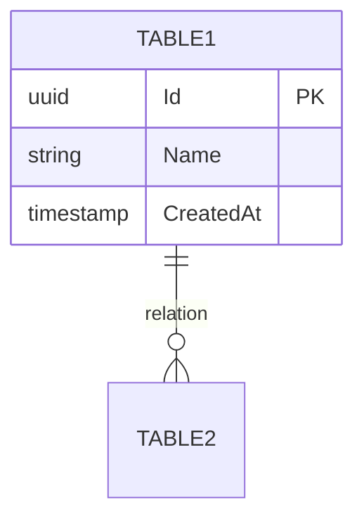

# Template Obsidian - Projets de Développement

**Version** : 1.0
**Objectif** : Structure normalisée réutilisable pour tout projet de développement

---

## Structure des dossiers

```
📁 NOM-PROJET/
├── 📁 00-MOC/                    # Maps of Content (index)
│   ├── MOC-Principal.md
│   ├── MOC-Architecture.md
│   ├── MOC-Database.md
│   ├── MOC-Features.md
│   ├── MOC-API.md
│   └── MOC-Decisions.md
│
├── 📁 01-Specs/                  # Spécifications projet
│   ├── CDC-NomProjet.md          # Cahier des charges
│   ├── SPEC-Fonctionnelle-001.md
│   └── SPEC-Technique-001.md
│
├── 📁 02-Database/               # Documentation base de données
│   ├── MOC-Database.md           # Index DB (ou dans 00-MOC)
│   ├── DB-Overview.md
│   ├── DB-Identity.md
│   ├── DB-Module1.md
│   └── ...
│
├── 📁 03-Architecture/           # Documentation technique
│   ├── ARCH-Overview.md
│   ├── ARCH-Infrastructure.md
│   ├── ARCH-Security.md
│   └── ARCH-Deployment.md
│
├── 📁 04-Features/               # Fonctionnalités
│   ├── FEAT-001-NomFeature.md
│   ├── FEAT-002-NomFeature.md
│   └── ...
│
├── 📁 05-API/                    # Documentation API
│   ├── API-Overview.md
│   ├── API-Auth.md
│   ├── API-Endpoints-Module1.md
│   └── ...
│
├── 📁 06-ADR/                    # Architecture Decision Records
│   ├── ADR-001-Choix-Framework.md
│   ├── ADR-002-Base-Donnees.md
│   └── ...
│
├── 📁 07-Meetings/               # Comptes-rendus
│   ├── 2025-01-15-Kickoff.md
│   ├── 2025-01-22-Sprint-Review.md
│   └── ...
│
├── 📁 08-Dev/                    # Notes de développement
│   ├── DEV-Setup-Local.md
│   ├── DEV-Conventions.md
│   ├── DEV-Tests.md
│   └── DEV-Debug-Notes.md
│
├── 📁 09-Resources/              # Ressources externes
│   ├── liens-utiles.md
│   ├── references-techniques.md
│   └── 📁 assets/
│
├── 📁 10-Archives/               # Documents obsolètes
│
└── 📁 _Templates/                # Templates Obsidian
    ├── TPL-Feature.md
    ├── TPL-Database.md
    ├── TPL-ADR.md
    ├── TPL-Meeting.md
    ├── TPL-API-Endpoint.md
    └── TPL-Spec.md
```

---

## Conventions de nommage

### Préfixes obligatoires

| Préfixe | Usage | Exemple |
|---------|-------|---------|
| `MOC-` | Map of Content | `MOC-Architecture.md` |
| `CDC-` | Cahier des charges | `CDC-NomProjet.md` |
| `SPEC-` | Spécification | `SPEC-Fonctionnelle-001.md` |
| `DB-` | Database schema | `DB-Identity.md` |
| `ARCH-` | Architecture | `ARCH-Overview.md` |
| `FEAT-` | Feature | `FEAT-001-Authentification.md` |
| `API-` | Documentation API | `API-Auth.md` |
| `ADR-` | Decision Record | `ADR-001-Choix-Framework.md` |
| `DEV-` | Notes dev | `DEV-Setup-Local.md` |
| `TPL-` | Template | `TPL-Feature.md` |

### Format des dates

- Meetings : `YYYY-MM-DD-Sujet.md`
- Versions : `YYYY-MM-DD` dans le frontmatter

### Numérotation

- Format : `XXX` (3 chiffres)
- Séquence continue par type
- Exemple : `FEAT-001`, `FEAT-002`, `ADR-001`

---

## Frontmatter standard

### Minimum requis (tous documents)

```yaml
---
title: Titre du document
type: [moc|spec|arch|feature|api|adr|meeting|dev]
status: [draft|review|approved|deprecated]
created: YYYY-MM-DD
updated: YYYY-MM-DD
tags:
  - tag1
  - tag2
---
```

### Feature (étendu)

```yaml
---
title: FEAT-001 Authentification
type: feature
status: in-progress
priority: high
created: 2025-01-15
updated: 2025-01-20
assignee: "@nom"
sprint: Sprint-3
dependencies:
  - "[[FEAT-002-Sessions]]"
  - "[[API-Auth]]"
tags:
  - feature
  - auth
  - security
---
```

### ADR (étendu)

```yaml
---
title: ADR-001 Choix du framework backend
type: adr
status: accepted
created: 2025-01-10
updated: 2025-01-12
decision-date: 2025-01-12
decision-makers:
  - "@lead-dev"
  - "@architecte"
supersedes: null
superseded-by: null
tags:
  - adr
  - backend
  - framework
---
```

### Meeting (étendu)

```yaml
---
title: Kickoff Projet
type: meeting
date: 2025-01-15
participants:
  - "@client"
  - "@dev1"
  - "@pm"
duration: 60min
status: done
next-meeting: 2025-01-22
tags:
  - meeting
  - kickoff
---
```

---

## Templates

### TPL-Feature.md

```markdown
---
title: FEAT-XXX {{title}}
type: feature
status: draft
priority: medium
created: {{date}}
updated: {{date}}
assignee:
sprint:
dependencies: []
tags:
  - feature
---

# {{title}}

## Contexte

Pourquoi cette feature est nécessaire.

## User Stories

- [ ] En tant que [ROLE], je veux [ACTION] afin de [BENEFICE]

## Critères d'acceptation

- [ ] Critère 1
- [ ] Critère 2

## Spécifications techniques

### Composants impactés

-

### Modifications base de données

-

### Endpoints API

-

## Maquettes / Wireframes

## Notes d'implémentation

## Tests

- [ ] Tests unitaires
- [ ] Tests intégration
- [ ] Tests E2E

## Liens

- [[MOC-Features]]
```

### TPL-Database.md

```markdown
---
title: DB-{{title}}
type: database
status: draft
created: {{date}}
updated: {{date}}
tables: []
tags:
  - database
  - schema
---

# {{title}}

## Vue d'ensemble

Description du module et de son rôle dans l'architecture.

## Diagramme ERD



## Tables

### TableName

| Colonne | Type | Contraintes | Description |
|---------|------|-------------|-------------|
| `Id` | `uuid` | PK | Identifiant unique |
| `CreatedAt` | `timestamptz` | NOT NULL | Date création (UTC) |
| `IsDeleted` | `boolean` | DEFAULT false | Soft delete |

**Index:** `IX_TableName_Column`

## Relations

| Table source | Table cible | Type | Description |
|--------------|-------------|------|-------------|
| `Table1` | `Table2` | 1:N | Description |

## Considérations

### Performance
- Index recommandés

### Conformité
- [ ] HDS - Données de santé
- [ ] RGPD - Données personnelles

## Liens

- [[MOC-Database]]
- [[DB-Overview]]
```

### TPL-ADR.md

```markdown
---
title: ADR-XXX {{title}}
type: adr
status: proposed
created: {{date}}
updated: {{date}}
decision-date:
decision-makers: []
supersedes: null
superseded-by: null
tags:
  - adr
---

# ADR-XXX : {{title}}

## Statut

Proposé | Accepté | Déprécié | Remplacé

## Contexte

Quel est le problème ou la situation qui nécessite une décision ?

## Options considérées

### Option 1 : [Nom]

**Description** :

**Avantages** :
-

**Inconvénients** :
-

### Option 2 : [Nom]

**Description** :

**Avantages** :
-

**Inconvénients** :
-

## Décision

Quelle option a été choisie et pourquoi.

## Conséquences

### Positives

-

### Négatives

-

### Risques

-

## Liens

- [[MOC-Decisions]]
```

### TPL-Meeting.md

```markdown
---
title: {{title}}
type: meeting
date: {{date}}
participants: []
duration:
status: scheduled
next-meeting:
tags:
  - meeting
---

# {{title}}

**Date** : {{date}}
**Durée** :
**Participants** :

---

## Ordre du jour

1.
2.
3.

## Notes

### Point 1

### Point 2

### Point 3

## Décisions prises

- [ ] Décision 1 → @responsable
- [ ] Décision 2 → @responsable

## Actions à faire

- [ ] Action 1 → @responsable → deadline
- [ ] Action 2 → @responsable → deadline

## Prochaine réunion

**Date** :
**Sujets prévus** :
-
```

### TPL-API-Endpoint.md

```markdown
---
title: API-{{module}}
type: api
status: draft
created: {{date}}
updated: {{date}}
version: 1.0
base-url: /api/v1/{{module}}
auth-required: true
tags:
  - api
  - {{module}}
---

# API {{Module}}

## Vue d'ensemble

Description du module API.

## Authentification

- Type : Bearer Token / API Key
- Header : `Authorization: Bearer {token}`

## Endpoints

### GET /{{module}}

**Description** : Liste des éléments

**Paramètres query** :

| Param | Type | Requis | Description |
|-------|------|--------|-------------|
| page | int | Non | Page (défaut: 1) |
| limit | int | Non | Limite (défaut: 20) |

**Réponse** :

```json
{
  "data": [],
  "pagination": {
    "page": 1,
    "limit": 20,
    "total": 100
  }
}
```

### GET /{{module}}/:id

**Description** : Détail d'un élément

**Paramètres path** :

| Param | Type | Description |
|-------|------|-------------|
| id | uuid | ID de l'élément |

**Réponse** :

```json
{
  "id": "uuid",
  "...": "..."
}
```

### POST /{{module}}

**Description** : Création

**Body** :

```json
{
  "...": "..."
}
```

**Réponse** : `201 Created`

### PUT /{{module}}/:id

**Description** : Mise à jour

### DELETE /{{module}}/:id

**Description** : Suppression

**Réponse** : `204 No Content`

## Codes d'erreur

| Code | Description |
|------|-------------|
| 400 | Bad Request |
| 401 | Unauthorized |
| 403 | Forbidden |
| 404 | Not Found |
| 422 | Validation Error |
| 500 | Internal Server Error |

## Liens

- [[MOC-API]]
- [[API-Overview]]
```

### TPL-Spec.md

```markdown
---
title: SPEC-XXX {{title}}
type: spec
status: draft
created: {{date}}
updated: {{date}}
version: 1.0
author:
reviewers: []
tags:
  - spec
---

# {{title}}

## Résumé

Description courte de la spécification.

## Objectifs

- Objectif 1
- Objectif 2

## Périmètre

### Inclus

-

### Exclus

-

## Exigences fonctionnelles

### EF-001 : [Titre]

**Description** :

**Priorité** : Haute | Moyenne | Basse

**Critères d'acceptation** :
- [ ]

### EF-002 : [Titre]

## Exigences non-fonctionnelles

### Performance

-

### Sécurité

-

### Accessibilité

-

## Contraintes

-

## Dépendances

-

## Liens

- [[MOC-Principal]]
```

---

## MOC Principal (exemple)

```markdown
---
title: MOC Principal - NomProjet
type: moc
status: active
created: YYYY-MM-DD
updated: YYYY-MM-DD
tags:
  - moc
  - index
---

# 🗂️ NomProjet

> Description courte du projet

## 📊 Statut

| Métrique | Valeur |
|----------|--------|
| Phase | Développement |
| Sprint | Sprint-3 |
| Avancement | 45% |

## 🔗 Navigation

### 📋 Spécifications
- [[CDC-NomProjet]]
- [[MOC-Features]]

### 🏗️ Architecture
- [[MOC-Architecture]]
- [[MOC-API]]

### 📝 Décisions
- [[MOC-Decisions]]

### 📅 Réunions récentes
```dataview
TABLE date, participants
FROM "07-Meetings"
SORT date DESC
LIMIT 5
```

### 🚀 Features en cours
```dataview
TABLE status, priority, assignee
FROM "04-Features"
WHERE status = "in-progress"
SORT priority DESC
```

## 📁 Structure

- [[00-MOC/]] - Index et navigation
- [[01-Specs/]] - Cahier des charges, spécifications
- [[02-Database/]] - Documentation base de données
- [[03-Architecture/]] - Documentation technique
- [[04-Features/]] - Fonctionnalités détaillées
- [[05-API/]] - Documentation API
- [[06-ADR/]] - Décisions d'architecture
- [[07-Meetings/]] - Comptes-rendus
- [[08-Dev/]] - Notes développement
- [[09-Resources/]] - Ressources externes
- [[10-Archives/]] - Documents obsolètes
```

---

## Plugins Obsidian recommandés

### Essentiels

| Plugin | Usage |
|--------|-------|
| **Dataview** | Requêtes dynamiques, tableaux |
| **Templater** | Templates avec variables |
| **Calendar** | Vue calendrier meetings |
| **Git** | Versioning automatique |

### Recommandés

| Plugin | Usage |
|--------|-------|
| **Kanban** | Board features/tasks |
| **Excalidraw** | Diagrammes, schémas |
| **Admonition** | Callouts stylisés |
| **Linter** | Formatage automatique |
| **Various Complements** | Auto-complétion |

### Configuration Templater

```
Template folder: _Templates
Trigger on new file: true
```

---

## Workflow quotidien

### Création de document

1. `Ctrl+N` → Nouveau fichier
2. `Alt+E` → Insérer template (Templater)
3. Remplir le frontmatter
4. Ajouter liens `[[...]]` vers MOC

### Mise à jour

1. Modifier `updated:` dans frontmatter
2. Mettre à jour `status:` si nécessaire
3. Commit Git si significatif

### Revue hebdomadaire

- [ ] Vérifier status des features
- [ ] Mettre à jour MOC si nouveaux docs
- [ ] Archiver documents obsolètes

---

## Initialisation nouveau projet

### Checklist

```
- [ ] Créer dossier projet
- [ ] Copier structure des dossiers
- [ ] Copier _Templates/
- [ ] Créer MOC-Principal.md
- [ ] Créer CDC-NomProjet.md
- [ ] Configurer .gitignore Obsidian
- [ ] Premier commit Git
```

### .gitignore Obsidian

```
.obsidian/workspace.json
.obsidian/workspace-mobile.json
.obsidian/plugins/*/data.json
.trash/
```

---

**Fin du template** - Version 1.0
