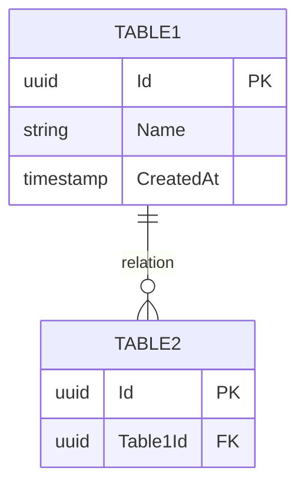

# {{title}}

## Vue d'ensemble

Description du module et de son rôle dans l'architecture.

## Diagramme ERD



## Tables

### TableName

| Colonne | Type | Contraintes | Description |
|---------|------|-------------|-------------|
| `Id` | `uuid` | PK | Identifiant unique |
| `CreatedAt` | `timestamptz` | NOT NULL | Date de création (UTC) |
| `UpdatedAt` | `timestamptz` | | Dernière modification |
| `IsDeleted` | `boolean` | DEFAULT false | Soft delete |
| `DeletedAt` | `timestamptz` | | Date de suppression |

**Index:**
- `IX_TableName_Column` - Index sur Column

**Contraintes:**
- `CK_TableName_Rule` - Description de la règle

## Relations

| Table source | Table cible | Type | Description |
|--------------|-------------|------|-------------|
| `Table1` | `Table2` | 1:N | Description |

## Requêtes fréquentes

```sql
-- Exemple de requête courante
SELECT * FROM "TableName"
WHERE "IsDeleted" = false
ORDER BY "CreatedAt" DESC;
```

## Considérations

### Performance
- Index recommandés
- Partitionnement si applicable

### Sécurité
- Données sensibles (chiffrement)
- Audit requis

### Conformité
- [ ] HDS - Données de santé
- [ ] RGPD - Données personnelles

## Liens

- [[MOC-Database]] - Index Database
- [[DB-Overview]] - Vue d'ensemble
- [[FEAT-XXX]] - Feature associée
